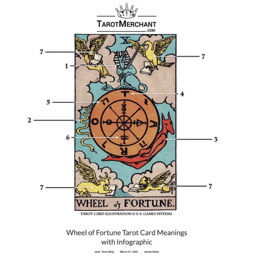

# dasa0739-FinalProjectIndividual
Sandy Asawaprecha |unikey: dasa0739  

This is the individual part of the creative coding major project in which I included time-based interactivity to the original code

# Wheel of Fortune — Time-Based Circle Animation (p5.js)

## How to interact with the work:
* As this is a time-based adaptation, there is no need to interact with the work.
* Simply load the page and the animation will happen for a total duration of approximately 45 seconds. 
* The animation is automatic so there is no user interaction required as it works on a time interval. 
* Watch as each circle appear one by one.
* Each circle spin at a different random speed.
* Each circle disappear one by one based on its random speed, from fastest to slowest. The circle that spin the fastest will disappear first and the circle that spin the slowest will disappear last. This represents how lives lived intensely may be shorter, while measured lives may endure longer.
* The animation will not continue indefinitely. 
* Reload the page to start the new animation. The intro and outro would be the same. However, each circle will spin at a different random speed from the previous animation. 
* The animation adapts to the screen size automatically. 

## Details of my individual approach to animating the group code

In terms of my individual approach, I choose to drive my individual code with time. 
 In the group code, there are 8 different circles. These circles will be animated while the background remain still. This will be different from other group members’ work as they use audio, user input and perlin noise to animate the still image. For example, user input. 

## References to inspiration for animating your individual code

Both Pacita Abad's Wheels of Fortune (2000) and the Wheel of Fortune tarot card have inspired my approach to this time-based animation. Abad's work is characterized by vibrant colors and explores themes of cultural connections, and her trapunto paintings fuse textile, paint, and political narrative while creating work that crosses borders and artistic disciplines. While her work often reflects how visual patterns and circular forms connect people across cultural and societal boundaries, the title "Wheel of Fortune" prompted me to explore how the wheel symbolizes human life journey.

To express this idea, I plan to create a time-based animation that begins with the appearance of circles, followed by their spinning motion to represent life’s progression. At first, I considered making the circles spin both clockwise and anti-clockwise to suggest human effort in changing one’s destiny. However, I later decided that all circles should spin clockwise, as human life universally begins at the same point—birth—and eventually ends at the same point—death. 

Furthermore, the Wheel of Fortune tarot card reinforces the decision to make all circles spin clockwise. The card depicts human life as a cycle of ups and downs—moments of success and obstacles that we must navigate. According to the reversed Wheel of Fortune's meaning, "a lack of recognition of life's fluidity may lead to arrogant mistakes and karmic retribution. Take a moment to humble yourself before the wheel and to experience life as it is." This teaches us that human cannot fully control or resist life's natural flow- we can only move forward with it. The clockwise rotation symbolizes this universal truth: all lives begin at the same point (birth) and move inevitably toward the same destination (death), regardless of the pace or path each individual takes.

As the circles appear and begin spinning, each moves at a different randomized speed. Some circles spin slowly while others rotate rapidly, reflecting the varied paces at which individuals experience life. The unique visual patterns within each circle represent diverse life experiences and journeys.

Through this animation, I explore the concept of "living in your own time." For instance, one person might achieve success early—entering university at 15—but tragically pass away from cancer at 30. Another might struggle to find direction until nearly 30, yet later discover their purpose and live a fulfilling life until 90. Both lives are equally valid, though they unfold at vastly different speeds.

At the animation's outro, circles begin to disappear one by one, starting with the fastest-spinning circles and ending with the slowest. This sequence embodies the metaphor that "those who burn brightest, burn fastest." Lives lived at an intense pace may be shorter, while those lived more slowly and deliberately may endure longer.This progression carries a deeper message: we should not compare our life's pace to others. Instead, we must focus on our own journey, keep moving forward, and trust that we will bloom in our own timeline.

In addition, the background is drawn with different color by quadrant depicting red, blue, green, and orange color. In relation to Pacita Abad (2000)'s work, this represents the fact that people in different geographical areas and have cultural differences but are universal in terms of each person having their own individuality, fortune and luck, and life experiences. Moreover, all humans have to experience birth and death.

## A short technical explanation of how my individual code works to animate the image and any appropriate references

### Change from group code

I did not make a lot of change to the group base code. I use the 8 circles that we created and keep the still background. These are key changes I made to the file specifically on the circles. 

1. Removed noLoop()
Group code: Static display only
My code: Continuous animation enabled through draw() loop

2. Added Animation System
Created animatedCircles array wrapping each circle with timing data:
 {  art: CircleArt instance,  angle: 0,  speed: random(0.3, 2.2),  appearTime: i * 1000,  disappearanceTime: calculated,  isDead: false}

3. Enhanced CircleArt Class
Added lifePosition property ('center', 'mid', or 'edge') to categorize circles for lifespan ordering

4. Implemented animateCircles() Function
Replaced drawAllCircles() with time-based animation logic:
Uses millis() to check appearance/disappearance timing
Updates rotation: c.angle += c.speed
Calculates opacity with easing functions
Applies transformations: rotate(), translate(), scale()
Controls fade with drawingContext.globalAlpha

5. Speed-Based Disappearance
Circles sorted by rotation speed
Fastest spinners disappear first, slowest last

### Tools and techniques from the course concept and outside of course concept

I used course concept from week 5 and week 9 of IDEA9103 Creative Coding in this assignment.

#### Course Concepts Applied
* Week 5: Animation Fundamentals
angleMode(DEGREES): Maintained degree mode for compatibility with existing circle formations (considered RADIANS but it disrupted the group's circle drawing functions)
Time-based animation principles: Applied timing and interval concepts
* Week 9: Transformations & Interpolation
rotate(): Spins each circle independently at randomized speeds
translate(): Positions circles at specific canvas coordinates
push() / pop(): Isolates transformations to prevent interference between circles
scale(): Adjusts circle sizes proportionally
lerp(): Smoothly interpolates opacity values during fade transitions
map(): Converts time progress to opacity ranges

#### Technique from outside the course
* I used millis() in p5js library
* millis() for Time-Based Control
Used to create precise timestamp-based animation rather than frame-based animation.
let t = millis();  // Current time in milliseconds
if (t >= c.appearTime) { /* Circle appears */ }
if (t > c.disappearanceTime) { /* Circle fades */ }

Why: Ensures consistent timing across devices regardless of frame rate variations. Allows exact control over when each circle appears and disappears.

* Easing Functions
Implemented quadratic easing for natural animation curves:
function easeInQuad(t) {
  return t * t;  // Gradual start, quick finish
}

Why: Linear interpolation feels mechanical. Easing adds emotional quality—the easeInQuad() function creates a fade-out that starts slowly and accelerates, symbolizing how life's end approaches gradually then arrives.
How: Takes normalized time (0-1), applies quadratic transformation, combines with lerp() for smooth opacity transitions.

* drawingContext.globalAlpha (Canvas API)
Accessed HTML Canvas API for unified opacity control:
drawingContext.globalAlpha = opacity / 255;
c.art.drawFn();  // All elements fade together
drawingContext.globalAlpha = 1.0;  // Reset

Why: Each circle contains multiple elements with different colors (fills, strokes, nested shapes). p5.js lacks a simple way to fade entire compositions uniformly. globalAlpha applies transparency to everything drawn within its scope.
How: Accesses underlying Canvas 2D rendering context, sets opacity multiplier (0-1), resets after each circle.

* Array Sorting for Speed-Based Disappearance
Circles sorted by rotation speed to determine exit order:
circlesBySpeed.sort((a, b) => b.speed - a.speed);
// Fastest spinner gets earliest disappearanceTime

Why: Creates conceptual link between life pace and lifespan—those who "burn brightest, burn fastest" disappear first.
How: JavaScript's .sort() method orders circles by descending speed, then assigns staggered disappearance times based on sorted position.

#### Technique from Internet
* Inspiration from Clock Challenge on the Coding Train Youtube channel.
* Inspiration from P5 

